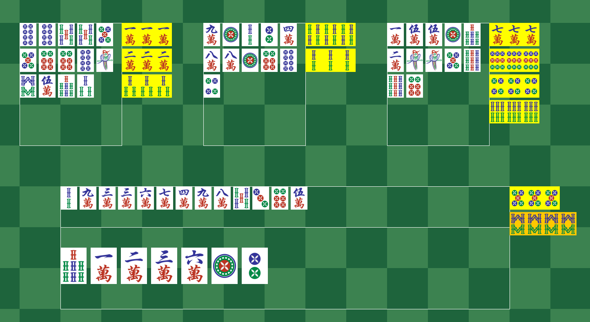

# Mahjong-Game-Framework-for-AI-Testing

This repository contains the source code for a fully implemented Sichuan Mahjong game in Java, complete with tile visualizations. It's designed as a testbed for AI research, offering a robust framework for AI strategy development and testing. 

## Table of Contents
1. [Features](#features)
2. [Getting Started](#getting-started)
3. [Customizing AI](#customizing-ai)
4. [Resources](#resources)
5. [Contributing](#contributing)

## Features

- **Fully Implemented Mahjong Game:** This game follows the Sichuan version rules of Mahjong as established in the 2016 Tencent Mahjong Tournament. You can learn more about the official rules [here](http://majiang.qq.com/webplat/info/news_version3/7207/25932/25933/25936/m16340/201611/523252.shtml).
- **Supports 4 Players:** The game can accommodate up to four players.
- **1v3 Mode:** Allows a player to compete against three AI opponents. The player can interact with their own tiles and decide what to play.
- **Customizable AI:** The AI can be modified according to any strategy. The current implementation uses a probability-based AI that optimizes for the highest probability hand combination. However, it can be replaced or extended to consider more factors, such as the actions of other players and tiles already played.
- (Coming)**Fight To Death:** The game doesn't immediately end after one player wins. Instead, all remaining players compete until only one remains or a tie between multiple players.
- (Coming)**Scoreboard:** Keeps track of the scores for each player.

## Getting Started

To start playing, simply clone the repository and run the main file. If there is an error due to assets on a different system path, simply change the path.

## Customizing AI

To customize the AI, follow these steps:

1. Create a new class under the "aimodel" package and implement the AI interface.
2. Navigate to the "model" package and open the "players" package.
3. Choose the AI you want to replace (AI1, AI2, or AI3).
4. In the selected AI class, change "this.ai = new ProbabilityAI();" to use the new AI class you created.

## Resources

- **Visual Assets:** The game uses a tile asset pack available [here](https://demching.itch.io/mahjong).
- **AI Model:** The current AI model used can be found [here](https://github.com/esrrhs/majiang_algorithm/tree/master).
- **Development:** Dev blogs can be found [here](https://youtu.be/04G1sfTPZr8).

## Contributing

We encourage you to contribute to this project, especially in the area of AI development. Please feel free to attach new AI models that not only consider the player's hand but also account for the strategies of other players.
